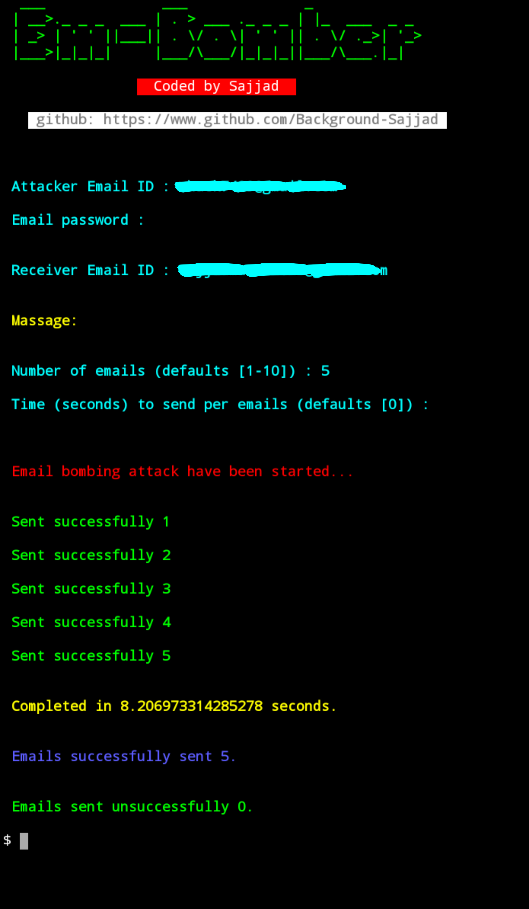

<h2 align="center">Em-Bomber</h2> 
<br/>


## About Em-Bomber.
Em-Bomber is a python (python3) script. Which can be use to send multiple emails.

## Screenshot.


## Installation.
```
$ apt-get update -y
```
```
$ apt-get upgrade -y
```
```
$ pkg install python -y
```
```
$ pkg install python3 -y
```
```
$ pkg install git
```
```
$ git clone https://github.com/Background-Sajjad/Em-Bomber
```
```
$ cd Em-Bomber
```
```
$ python3 em-bomber.py
```
Before enter your gmail id make sure the gmail has _allow less secure app_ is on.

## This tool available for
- Tested on Termux
## Warning
 **This tool is only for educational purposes. Don't use this tool any illegal. If you use this tool in any illegal way then we are not responsible for any case.**
